# sweet-world 
This is my first milestone project for the Level-5 Web Application Development program with New City College. 
This is the webpage link of my project. <a href="https://abi19x.github.io/sweet-world/" target="_blank">Click here</a>.

 This website appears to compose complete pages, responsive webpage featuring a navigation bar, carousel, a video illustrating how cakes are created, sections for cakes categorized by occasion, a footer with contact info, and operating hours.

<ul>
  <li>Header, main, section and footer element tags are properly used in order to improve readability and search engine optimisation (SEO). Aria-label attribute is also used to enhance accessibility</li>
  <li>Bootstrap's grid system, such as col- and row are deliberately implemented as responsive classes to ensure the website adapts to different screen sizes.</li>
  <li>In addition, the carousel and cards are used and clearly proven to be well-suited for showcasing images and all essential information that users need to know about the cakes in store.</li>
  <li>The styling of the web pages consist consistent use of custom classes (e.g. <strong>.custom-button-outline</strong>) which adds unique branding and distinctive visually appealing feature. </li>
  <li>The user engagement aspect was given much though in this project as clear and precise call-to-action (CTA) like the <strong>Click and Collect</strong> buttons encourage user interaction and prompt potential customers to place an order from our products. Furthermore, social media links are designed for casual users and potential customers to provide connectivity.</li>
</ul>

**Purpose of Project**  
The ultimate purpose was to design and create a website for a bakery shop. The name of this shop is going to be *Sweet World* and their business is selling different types of cakes for special occasions. Customers will have to go to their website, find out what kinds of cakes they have and submit a form to pre-order what they like in store.  

I have used four main colors in this project.  
*#F7B8DE - which is light pink  
*#BF608C - which is dark pink  
*DC8DB6 - which is a regular pink as a highlight colour  

I have also used 'Inter' and 'Mocondo' to style my fonts which I have imported them Google fonts.  

**My hand sketch wireframes**  
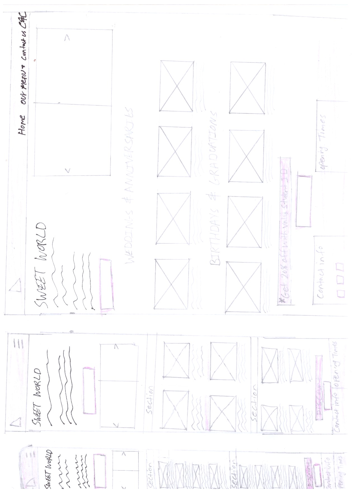 
 
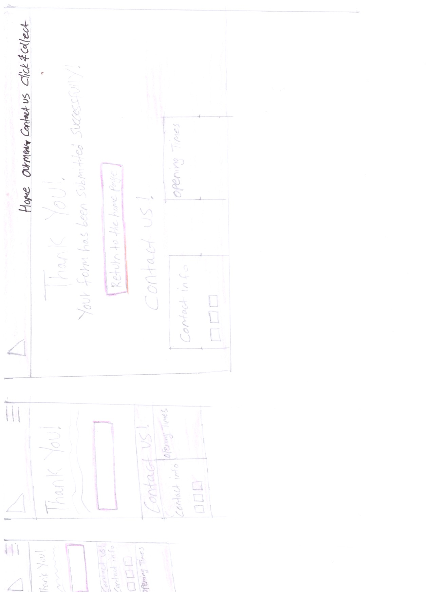 

**The final project** 
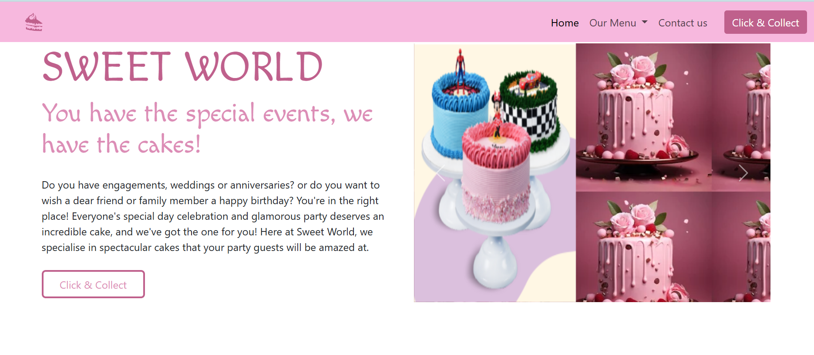 
This is the home page
 
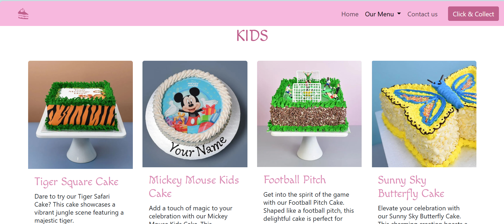 
This is our menu page, kids section
 
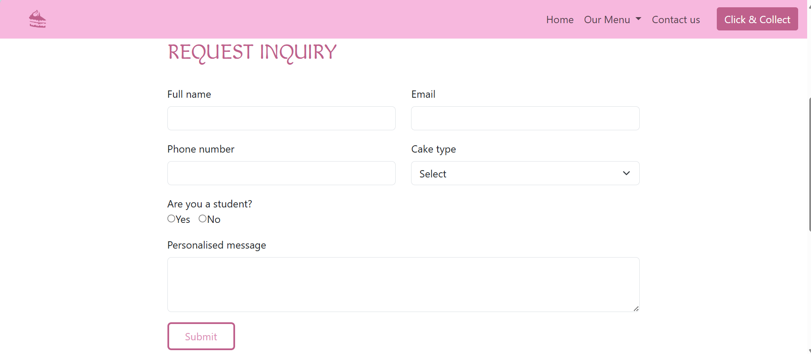 
This is the booking page with the form to be submitted.
 
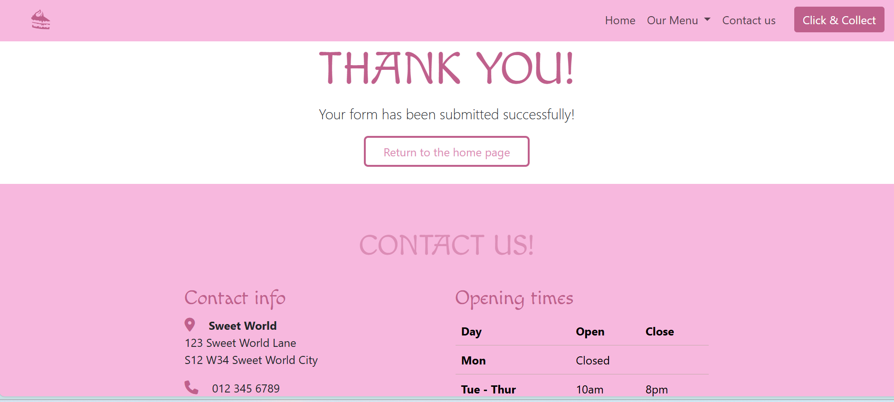 
This is the message you receive after submitting the form successfully.
 
 
This is the screenshot of the video which is placed on the menu page
 

## Deployment  
The deployment process is going to help you to set up an environment for your live project, and it is pretty much straight forward to comprehend and apply.
<ol>
  <li>Go to settings in your github repository</li>
  <li>In the <strong>'code and automation'</strong> section, select <strong>'pages'</strong></li>
  <li>Set <strong>'Source'</strong> to <strong>'Deploy from Branch/</strong></li>
  <li>Select <strong>'main'</strong> from the branch section</li>
  <li>Set <strong>Folder</strong> to <strong>'/(root)'</strong>, then click <strong>'Save'</strong></li>
  <li>Go to the <strong>'Code'</strong> tab, wait few minutes and refresh</li>
  <li>On the right hand side click <strong>'github pages'</strong></li>
  <li>Click <strong>'View Deployment'</strong></li>
  
</ol>

### Credits  
<uL>
  <li>
I must emphasize that I took all the pictures and contents of my project from a bakery website and would like to give all credits to this website as I got most of my ideas from them. <a href="https://www.cakebox.com/">Cake Box Website</a> 
  </li>
  <li>I have used <a href="https://designs.ai/logomaker/start/create?company_name=Sweet%2520World">AI designs</a>> to create a logo which is content and colour appropriate for this project</li>
  <li>I have used <a href="https://favicon.io/">favcon</a>, in order to generate the small sized logo icon which I placed on the browser tab.</li>
  <li>I also would like to give attributes to <a href="https://getbootstrap.com/">Bootstrap</a>, for aiding me to style my cards, containers and the whole page in general easily and gracefully.</li>
  <li>Another helpful source to thank in my list is <a href="https://coolors.co/image-picker">Color picker</a>, which supported me to choose a colour palette that goes hand in hand with colourful theme I have chosen for this project. They also have a nice feature that allows you to export the group of colours you picked to your internal files.</li>
  <li>The video placed on the menu page was obtained from <a href="https://www.youtube.com/shorts/gM46EWLTC9E" target="_blank">YouTube.</a>
  <li>Last but not least my gratitude will go to <a href="https://uk.pinterest.com/">Pintrest</a>, for providing and allowing me to download elegant pictures with high resolution which worked perfectly with the design and development of my project. The pictures I picked from Pintrest are used in the carousel slide shows in Our Menu page of this website.</li>
</uL>
<h3>External sources</h3>

This JavaScript code was used from an external source in order to make sure that the Bootstrap navbar collapses when navigating within the page. 
  
    The above code was obtained from the <a href="https://github.com/Code-Institute-Submissions/Portfolio-project-199/blob/main/signup-confirmation.html">github page</a> of a developer who works for Code Institute.
    

### Testing  
<ul>
  <li>I have made sure there are no broken links.</li>
  <li>I have double checked that all external links are open in a separate tab.</li>
  <li>The site's navigation, layout and colour are consistent and rationale.</li>
  <li>The customer is not able to break the site by providing unvalidated inputs. For instance in the phone number filed only numbers can be entered.</li>
  <li>All forms handle eloquently empty or invalid input fields. See the screenshot below.</li>
  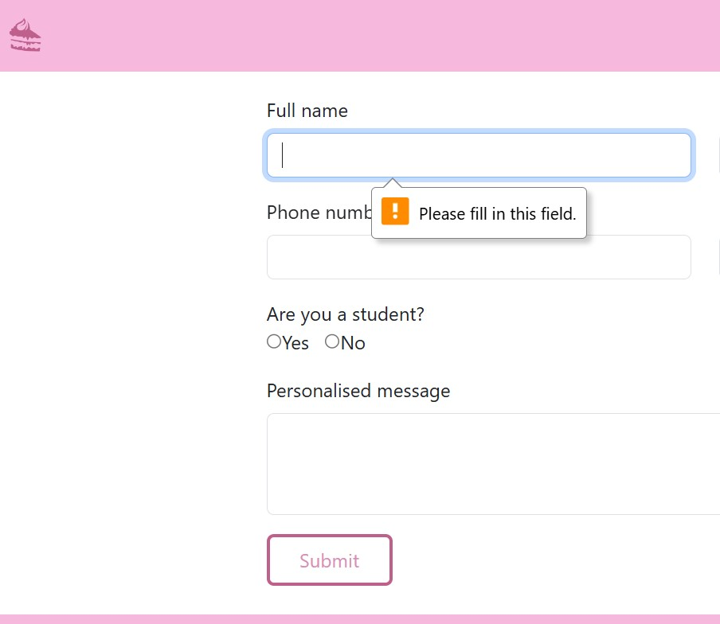
  <li>All page elements function and display well on all media screen sizes. I have double checked the responsiveness of all pages on mobile, tablet and desktop screen sizes.</li>
  <li>All types of multimedia content used in this project function and look well on different popular browsers. I have checked the deployed on "Microsoft Edge" and "Google Chrome".</li>
  <li>I have confirmed multiple times that all four pages are linked rightfully to the custom CSS file.</li>
  <li>All HTML files in this project passes through the official W3C validator with no issues. I used this <a href="https://validator.w3.org/">Website</a> to test and validate all the codes written on HTML. See the screenshot below.</li>
  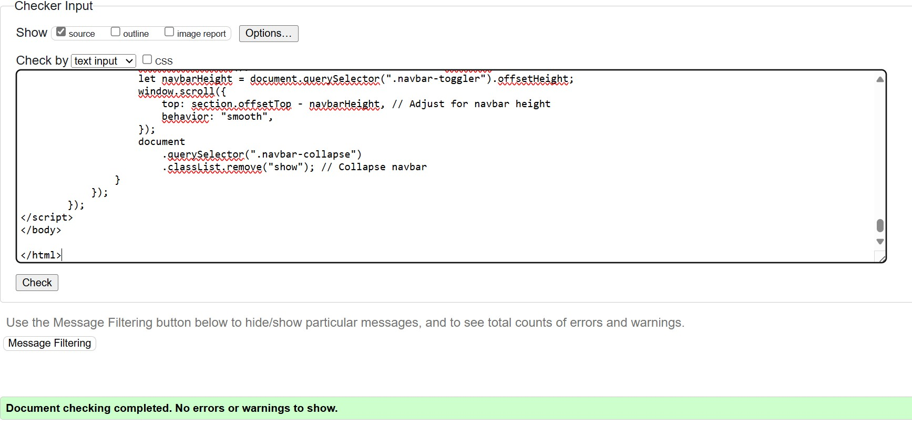
  <li>I have used an "alt" attribute in all image elements throughout the project, which provides a brief description of all non text elements of having a text equivalent for the visually impaired users</li>
  <li>An error was found when I tested the custom CSS file of this project in the official W3 Jigsaw CSS validor. I used this <a href="https://jigsaw.w3.org/css-validator/">website</a> to test and validate all the codes writted on my custom CSS file. See the screenshot below.</li>
  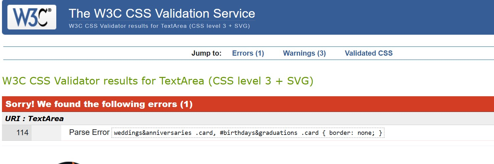
  <li> I have revisited the page, went to the indicated error detected above and fixed it to the best of my ability. I can now confirm that the custom CSS file in this project passes through the official (Jigsaw) validator with no issues. See the screenshot below.</li>
  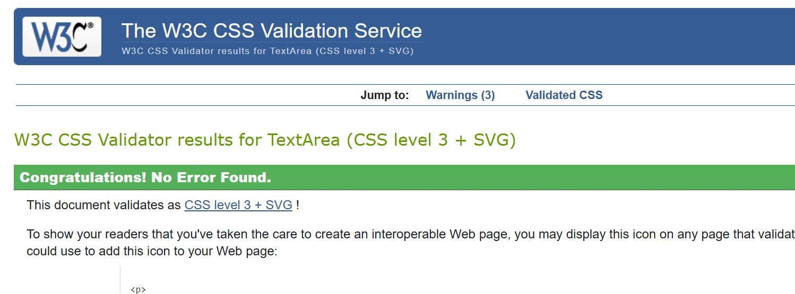
  <li><strong>our-menu</strong> page was tested using the official W3 validator and multiple errors were detected as shown in the screenshot image below.</li>
  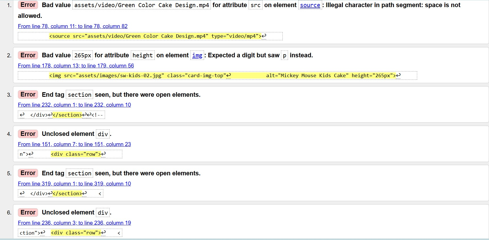
  <li><strong>our-menu</strong> page was revisited one more time and all errors were fixed. I have used the description provided by the HTML validator tool to find out precisely where the errors are located and what they are. For example, the first error detected was <em>illegal character in path segment: space is not allowed.</em> So clicked the video file which was located in my <stron>assets</strong> folder and renamed it without any spaces. The second error occured because a character that was not an digit was find when specifying how wide the video was going to be on the page. This was fixed by deleting the unacceptable characters given to the attribute. The rest of the erros occured as a result of not closed <em>divs</em> in multiple places. All of them were located according to the W3C validator and closed all <em>divs</em> which were not before. You can see in the screenshot image below that all erros in the <strong>our-menu</strong> page are now fixed.</li>
  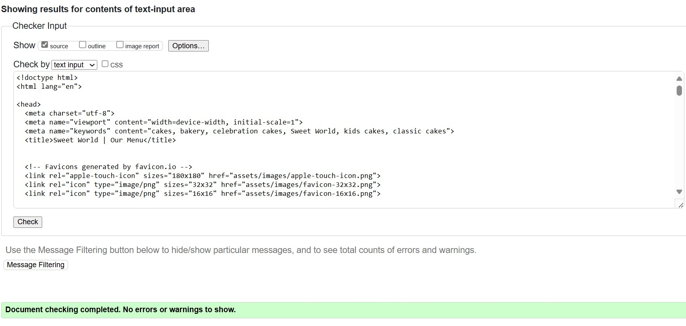
  <li>The <strong>booking</strong> page was tested using the official W3 HTML validator and an error was detected as shown in the screenshot image below.</li>
  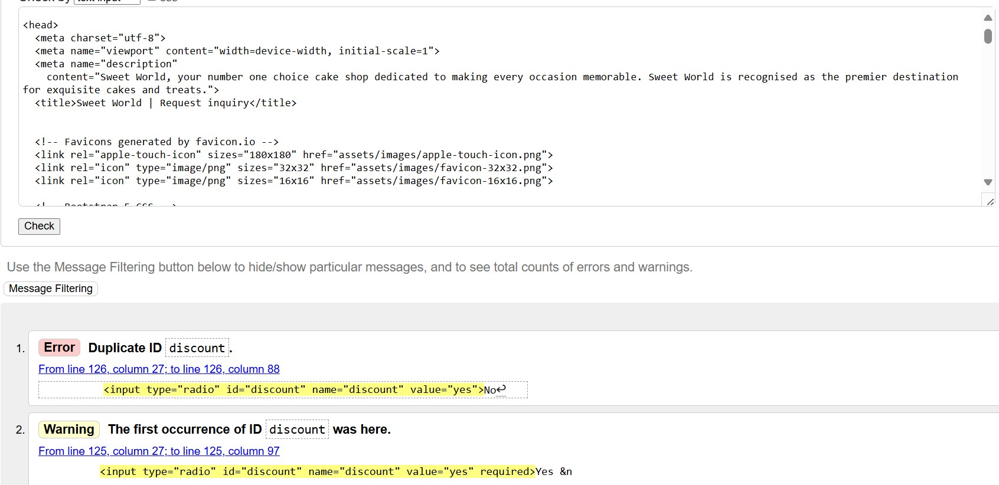
  <li>I have visited the <strong>booking</strong> page one more time, located where the error is thanks to the validator tool and fixed it. The error happened because two different elements were given an identical Id. I have managed to change the Id for one of the elements and now the web page is error free. See the screenshot image below.
  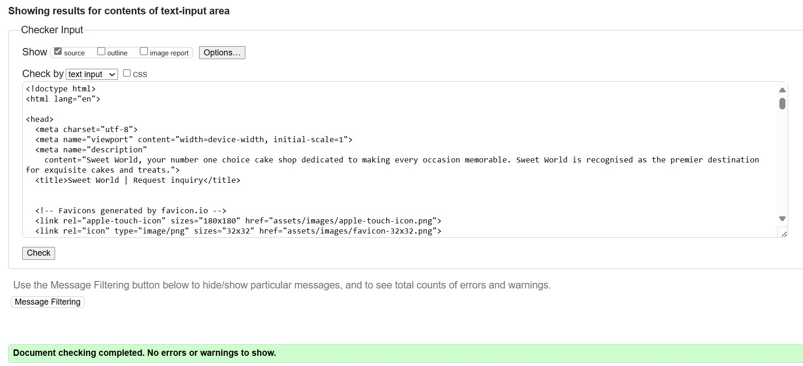
  <li>All webpages are codded in a consistent manner to eaase readability, and there is no unneeded complexity or commented out code within the files.</li>
</ul>

