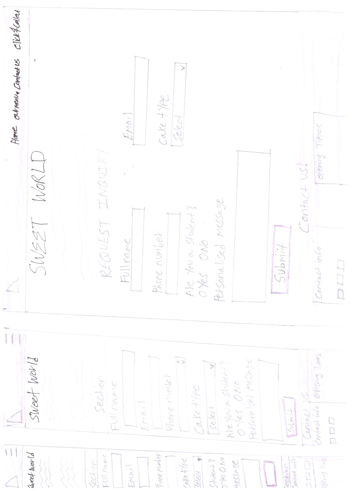

# sweet-world 
This is my first milestone project for the Level-5 Web Application Development program with New City College. 
This is the webpage link of my project. <a href="https://abi19x.github.io/sweet-world/" target="_blank">Click here</a>.

**Purpose of Project**  
The ultimate purpose was to design and create a website for a bakery shop. The name of this shop is going to be *Sweet World* and their business is selling different types of cakes for special occasions. Customers will have to go to their website, find out what kinds of cakes they have and submit a form to pre-order what they like in store.  

I have used four main colors in this project.  
*#F7B8DE - which is light pink  
*#BF608C - which is dark pink  
*DC8DB6 - which is a regular pink as a highlight colour  

I have also used 'Inter' and 'Mocondo' to style my fonts which I have imported them Google fonts.  

**My hand sketch wireframes**  
 
 
 

**The final project** 
 
 
 
 

## Deployment  
The deployment process is going to help you to set up an environment for your live project, and it is pretty much straight forward to comprehend and apply.
<ol>
  <li>Go to settings in your github repository</li>
  <li>In the <strong>'code and automation'</strong> section, select <strong>'pages'</strong></li>
  <li>Set <strong>'Source'</strong> to <strong>'Deploy from Branch/</strong></li>
  <li>Select <strong>'main'</strong> from the branch section</li>
  <li>Set <strong>Folder</strong> to <strong>'/(root)'</strong>, then click <strong>'Save'</strong></li>
  <li>Go to the <strong>'Code'</strong> tab, wait few minutes and refresh</li>
  <li>On the right hand side click <strong>'github pages'</strong></li>
  <li>Click <strong>'View Deployment'</strong></li>
  
</ol>

### Credits  
<uL>
  <li>
I must emphasize that I took all the pictures and contents of my project from a bakery website and would like to give all credits to this website as I got most of my ideas from them. <a href="https://www.cakebox.com/">Cake Box Website</a> 
  </li>
  <li>I have used <a href="https://designs.ai/logomaker/start/create?company_name=Sweet%2520World">AI designs</a>> to create a logo which is content and colour appropriate for this project</li>
  <li>I have used <a href="https://favicon.io/">favcon</a>, in order to generate the small sized logo icon which I placed on the browser tab.</li>
  <li>I also would like to give attributes to <a href="https://getbootstrap.com/">Bootstrap</a>, for aiding me to style my cards, containers and the whole page in general easily and gracefully.</li>
  <li>Another helpful source to thank in my list is <a href="https://coolors.co/image-picker">Color picker</a>, which supported me to choose a colour palette that goes hand in hand with colourful theme I have chosen for this project. They also have a nice feature that allows you to export the group of colours you picked to your internal files.</li>
  <li>Last but not least my gratitude will go to <a href="https://uk.pinterest.com/">Pintrest</a>, for providing and allowing me to download elegant pictures with high resolution which worked perfectly with the design and development of my project. The pictures I picked from Pintrest are used in the carousel slide shows in Our Menu page of this website.</li>
</uL>

